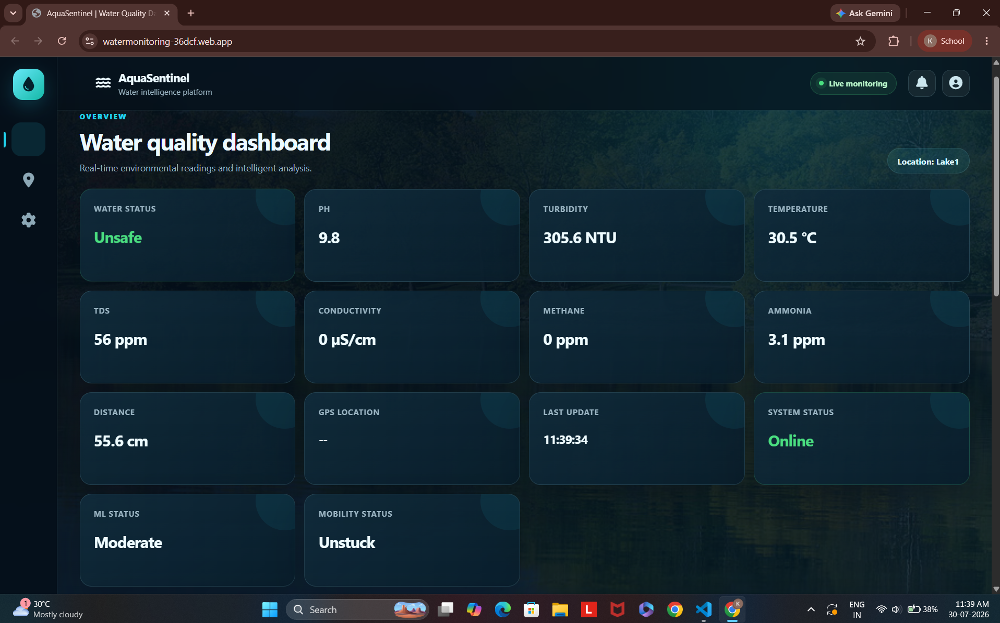
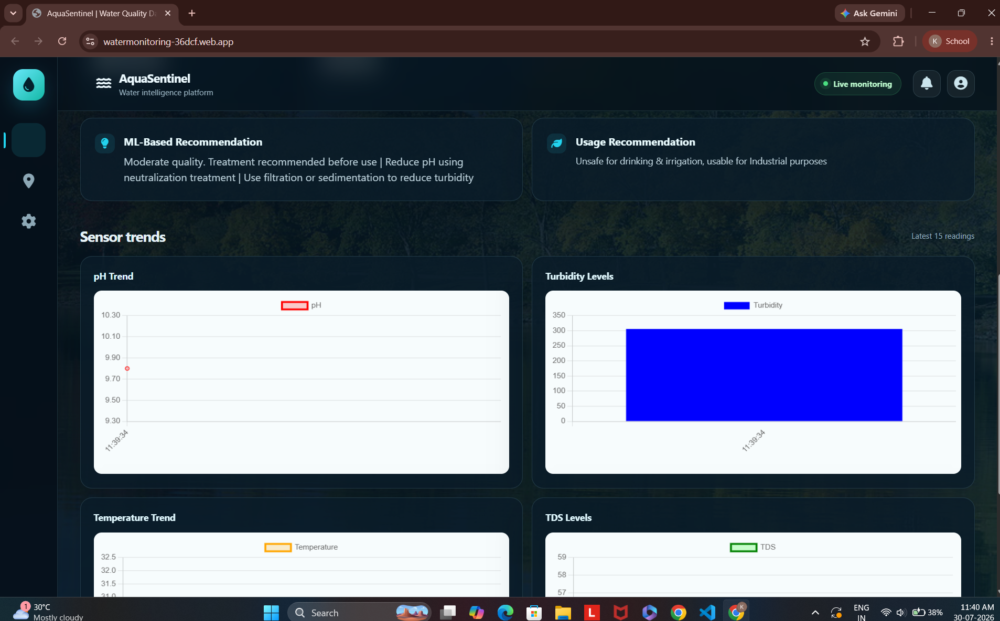
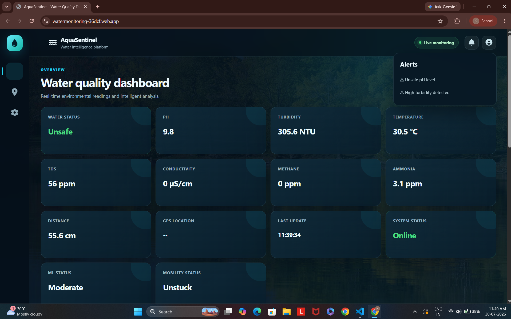
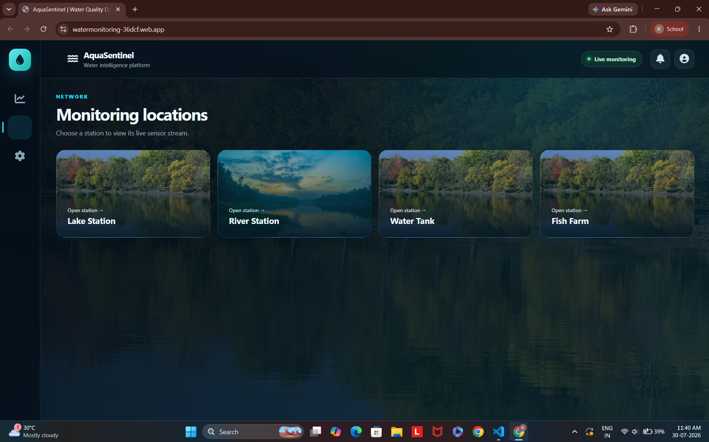
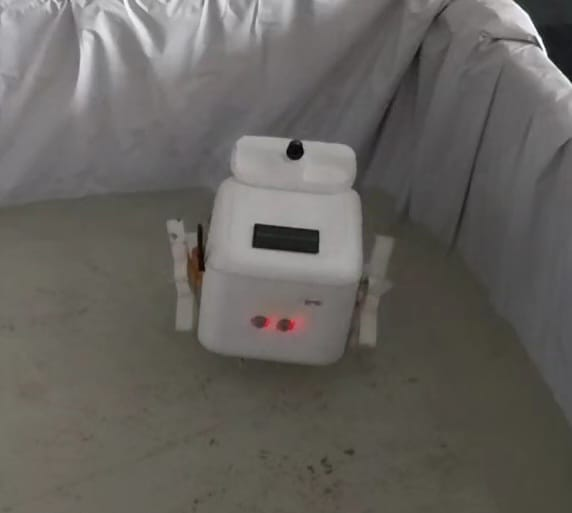
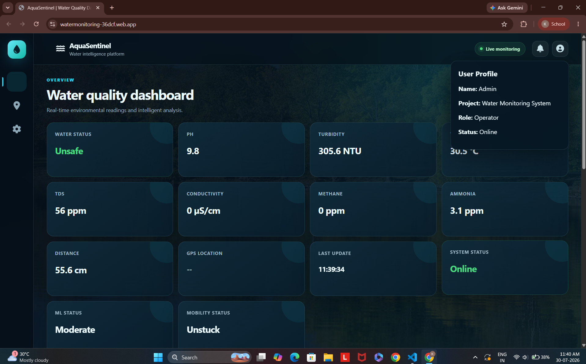
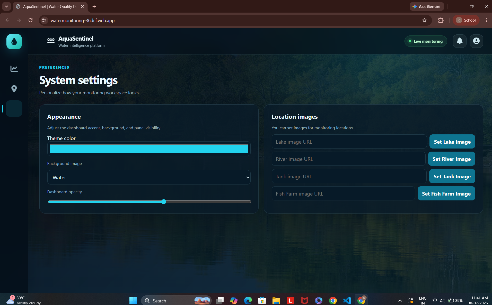
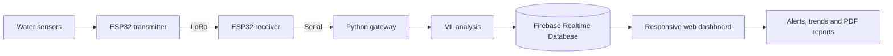

# AquaSentinel

### IoT and machine-learning powered water quality monitoring

[](https://watermonitoring-36dcf.web.app)
[](https://firebase.google.com/)
[](https://www.espressif.com/en/products/socs/esp32)

> AquaSentinel is an end-to-end smart water monitoring system that combines an ESP32 sensor network, long-range LoRa communication, Firebase, and machine learning to turn live environmental readings into alerts and actionable reuse recommendations.

<p align="center">
  <a href="https://watermonitoring-36dcf.web.app">
    
  </a>
</p>

<p align="center">
  <strong><a href="https://watermonitoring-36dcf.web.app">View the live dashboard</a></strong>
  ·
  <a href="#system-architecture">Architecture</a>
  ·
  <a href="#getting-started">Getting started</a>
</p>

## Why AquaSentinel?

Water monitoring is often manual, localized, and slow to act on. AquaSentinel provides a continuous pipeline from field sensors to a web dashboard, allowing operators to:

- Monitor water conditions remotely in real time
- Detect unsafe pH, turbidity, TDS, and mobility conditions
- Receive machine-learning based quality classifications
- Get recommendations for drinking, irrigation, or industrial reuse
- Compare multiple locations from one responsive interface
- Export sensor readings and analysis as a PDF report

## Product highlights

| Capability | What it provides |
| --- | --- |
| Live telemetry | pH, turbidity, temperature, TDS, conductivity, methane, ammonia, distance, and GPS |
| Long-range connectivity | LoRa communication between ESP32 transmitter and receiver nodes |
| Intelligent analysis | ML classification plus treatment and reuse recommendations |
| Operational awareness | Threshold alerts, device mobility detection, and online status |
| Multi-location monitoring | Lake, river, tank, and fish-farm station views |
| Reporting | Downloadable water-quality PDF reports |
| Responsive dashboard | Desktop and mobile monitoring through Firebase Hosting |

## Gallery

### Trends and recommendations

The dashboard combines rule-based status checks with ML recommendations and live Chart.js visualizations.



### Alerts and location network

| Live safety alerts | Monitoring locations |
| --- | --- |
|  |  |

### Physical prototype

The field unit packages the sensing and communication hardware into a mobile platform for water-body monitoring.

<p align="center">
  
</p>

<details>
<summary><strong>More interface views</strong></summary>
<br>

| Operator profile | System settings |
| --- | --- |
|  |  |

</details>

## System architecture



### Data flow

1. Sensors collect water-quality and device-position readings.
2. The transmitter sends the payload over LoRa.
3. The receiver forwards the data to the Python gateway.
4. The gateway applies the trained ML model and reuse logic.
5. Firebase synchronizes the processed result with the dashboard.
6. Operators see current readings, warnings, recommendations, and trends.

## Technology stack

| Layer | Technologies |
| --- | --- |
| Hardware | ESP32, LoRa SX1278, pH, turbidity, TDS, ultrasonic, and gas sensors |
| Edge communication | Arduino/C++, LoRa, serial communication |
| Gateway and ML | Python, scikit-learn, joblib, PySerial |
| Cloud | Firebase Realtime Database, Firebase Hosting |
| Frontend | HTML, CSS, JavaScript, Chart.js, jsPDF |

## Repository structure

```text
.
├── arduino/
│   ├── transmitter.ino
│   └── receiver.ino
├── lap/
│   └── lap.ino
├── screenshots/
├── gateway.py
├── lora.py
├── model.pkl
├── index.html
├── firebase.json
└── README.md
```

## Getting started

### View the dashboard locally

Because the frontend is static, you can serve it with any local web server:

```bash
python -m http.server 8000
```

Open `http://localhost:8000`.

### Run the hardware gateway

1. Install the Python dependencies:

   ```bash
   pip install pyserial firebase-admin joblib scikit-learn
   ```

2. Add your Firebase Admin SDK key as `serviceAccountKey.json`.
3. Update the serial port in `gateway.py` for your receiver.
4. Flash the transmitter and receiver sketches to the ESP32 boards.
5. Start the gateway:

   ```bash
   python gateway.py
   ```

> Never commit `serviceAccountKey.json` or other private Firebase credentials.

### Deploy the dashboard

```bash
firebase login
firebase deploy --only hosting
```

## Future improvements

- Historical data storage and time-range filtering
- User authentication and role-based access
- Progressive Web App support and offline alerts
- Map-based GPS tracking
- Automated calibration and sensor-health diagnostics
- Additional ML training data and model performance reporting

## Project links

- **Live application:** https://watermonitoring-36dcf.web.app
- **Repository:** https://github.com/kamalesh-sankaranarayanan/IoT-based-Water-Monitoring

---

Built as a practical IoT solution for faster, data-driven water-quality decisions.
